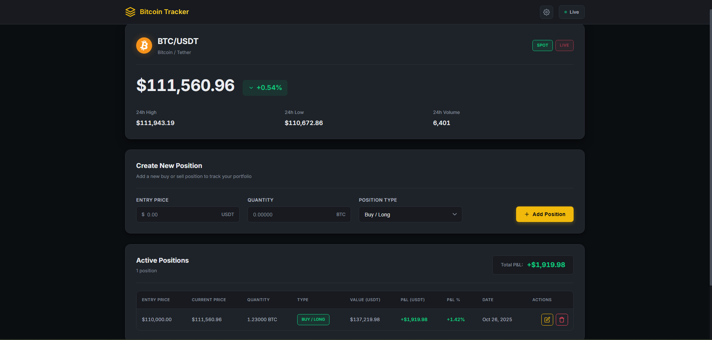
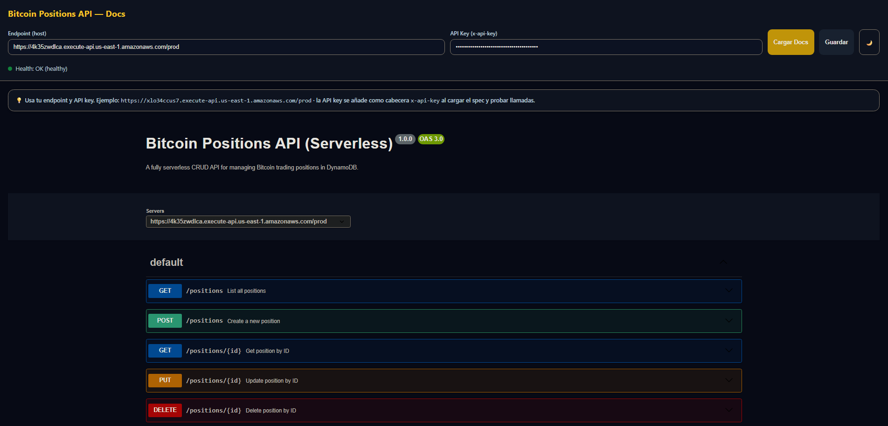

Cloud Computing - AWS Projects

[](https://aws.amazon.com/)
[](https://www.python.org/)
[](https://nodejs.org/)
[](LICENSE)

> **Cloud Computing coursework** — Universidad de Las Palmas de Gran Canaria  
> Two production-grade AWS projects demonstrating streaming data pipelines and serverless application architectures

---

## 📚 Table of Contents

- [Overview](#-overview)
- [Projects](#-projects)
  - [1. ETL Data Science Pipeline](#1-etl-data-science-pipeline)
  - [2. Bitcoin Positions Tracker](#2-bitcoin-positions-tracker)
- [Architecture Highlights](#-architecture-highlights)
- [Technologies Used](#-technologies-used)
- [Quick Start](#-quick-start)
- [Project Details](#-project-details)
- [Cost Analysis](#-cost-analysis)
- [Academic Context](#-academic-context)
- [Contributing](#-contributing)
- [License](#-license)
- [Author](#-author)

---

## 🌟 Overview

This repository contains two comprehensive cloud computing projects built on AWS, demonstrating expertise in:

- **Streaming data architectures** with Kinesis, Firehose, and Glue
- **Serverless applications** with Lambda and API Gateway
- **Infrastructure as Code** using CloudFormation
- **Containerization** with Docker and ECS Fargate
- **Real-time data processing** and ETL workflows
- **Cost optimization** strategies (87% savings demonstrated)

Both projects are production-ready, fully documented, and deployable via automated scripts.

---

## 📁 Projects

### 1. ETL Data Science Pipeline

**Energy Consumption Analytics** — Real-time streaming data pipeline for energy monitoring and analysis.

#### 🎯 Features
- **Real-time ingestion** via Amazon Kinesis Data Streams
- **Automated ETL** with AWS Glue jobs (daily & monthly aggregations)
- **Dynamic partitioning** using Lambda transformations
- **Data cataloging** with Glue Crawler
- **Scalable storage** in S3 with raw/processed separation

#### 🏗️ Architecture
```
Custom Data (JSON) → Kinesis Stream → Firehose (+ Lambda) → S3 (raw)
                                                                ↓
                                           Glue Crawler → Data Catalog
                                                                ↓
                                           Glue ETL Jobs → S3 (processed)
                                                                ↓
                                           Final Crawler → Athena-ready tables
```

#### 🚀 Quick Deploy
```powershell
# Configure AWS credentials
aws configure

# Deploy entire pipeline (automated)
cd etl-data-science/scripts
.\00_run_all.ps1
```

#### 📊 Key Metrics
- **Processing time**: ~5 minutes for 1000 records
- **Cost**: ~$15-25/month (varies with data volume)
- **Scalability**: Handles 1000+ records/second

[**→ Full Documentation**](etl-data-science/README.md)

---

### 2. Bitcoin Positions Tracker

**Production-grade cryptocurrency portfolio manager** — Full-stack application with dual AWS architectures.

#### 🎯 Features
- **Real-time Bitcoin prices** via Binance WebSocket
- **CRUD API** for position management
- **Dual deployment options**: ECS Fargate vs. Lambda (serverless)
- **Auto-generated API docs** (OpenAPI/Swagger)
- **Modern web interface** with live P&L calculations
- **API Gateway** authentication with usage plans

#### 🏗️ Architectures

**Option A: ECS Fargate (Containerized)**
```
Browser → API Gateway → VPC Link → NLB → ECS Fargate → DynamoDB
         (with API key)                    (Express.js)
```

**Option B: Lambda (Serverless)** ⭐ Recommended
```
Browser → API Gateway → Lambda Functions (5) → DynamoDB
         (with API key)
```

#### 🚀 Quick Deploy

**Serverless (5 minutes)**
```bash
# 1. Package Lambda code
cd full-app-deployment/backend/lambda/lambdas
npm install --omit=dev && cd ..
Compress-Archive -Path lambdas/* -DestinationPath lambda-code.zip

# 2. Upload to S3
aws s3 mb s3://bitcoin-lambda-deploy
aws s3 cp lambda-code.zip s3://bitcoin-lambda-deploy/

# 3. Deploy stack
aws cloudformation deploy \
  --template-file deploy.yml \
  --stack-name bitcoin-tracker-lambda \
  --parameter-overrides LambdaCodeBucket=bitcoin-lambda-deploy \
  --capabilities CAPABILITY_NAMED_IAM
```

**ECS Fargate (15 minutes)**
```bash
cd full-app-deployment/backend/ecs
make build && make push  # Build and push Docker image
aws cloudformation deploy \
  --template-file deploy.yml \
  --stack-name bitcoin-tracker-ecs \
  --capabilities CAPABILITY_NAMED_IAM
```

#### 📸 Screenshots

<table>
<tr>
<td width="50%">
  
**Live Trading Dashboard**  


</td>
<td width="50%">

**Interactive API Docs**  


</td>
</tr>
</table>

[**→ Full Documentation**](full-app-deployment/README.md)

---

## 🏛️ Architecture Highlights

### ETL Pipeline Architecture
- **Decoupled design**: Producer → Stream → Processor → Storage
- **Automated orchestration**: Sequential Glue job execution
- **Cost-optimized**: Pay-per-use with Firehose buffering
- **Scalable**: Auto-sharding in Kinesis, parallel Glue jobs

### Application Architecture Comparison

| Aspect | ECS Fargate | Lambda (Serverless) |
|--------|-------------|---------------------|
| **Deployment** | Container orchestration | Individual functions |
| **Scaling** | Manual task count | Automatic (0→1000) |
| **Cold start** | Always warm | ~200ms first request |
| **Cost** | $57/month | **$7.53/month** ⬇️87% |
| **Complexity** | VPC, NLB, ECS service | API Gateway + Lambda |
| **Best for** | Traditional apps | Event-driven workloads |

---

## 🛠️ Technologies Used

### ETL Data Science
- **Streaming**: Amazon Kinesis Data Streams, Kinesis Firehose
- **Processing**: AWS Lambda (Python 3.9), AWS Glue (PySpark)
- **Storage**: Amazon S3 (partitioned), Glue Data Catalog
- **Analytics**: Amazon Athena (queryable tables)
- **IaC**: PowerShell automation scripts

### Bitcoin Tracker
- **Backend**: Node.js 18, Express.js, AWS SDK v3
- **Compute**: AWS Lambda / ECS Fargate
- **API**: API Gateway (REST), OpenAPI 3.0
- **Database**: DynamoDB (serverless NoSQL)
- **Networking**: VPC, VPC Endpoints, Network Load Balancer
- **Frontend**: Vanilla JavaScript, Binance WebSocket API
- **IaC**: CloudFormation (1300+ lines YAML)

---

## ⚡ Quick Start

### Prerequisites
```bash
# AWS CLI configured
aws configure

# For ETL project
- PowerShell 5.1+
- Python 3.9+

# For Bitcoin tracker
- Node.js 18+
- Docker (for ECS deployment)
```

### Clone Repository
```bash
git clone https://github.com/yourusername/ulpgc-cloud-computing-aws.git
cd ulpgc-cloud-computing-aws
```

### Deploy Projects

**ETL Pipeline**
```powershell
cd etl-data-science/scripts
.\00_run_all.ps1  # Full automated deployment
```

**Bitcoin Tracker (Serverless)**
```bash
cd full-app-deployment/backend/lambda
./deploy.ps1  # PowerShell script handles everything
```

---

## 📖 Project Details

### ETL Data Science Pipeline

#### Key Components
1. **Producer (`kinesis.py`)**: Reads custom JSON data and streams to Kinesis
2. **Lambda Processor**: Adds partition keys for dynamic S3 organization
3. **Glue Crawler**: Catalogs raw data schema
4. **Glue ETL Jobs**: Daily and monthly aggregations
5. **Final Crawler**: Makes processed data queryable in Athena

#### Custom Data Format
```json
{
  "devices": [
    {
      "type": "HVAC System",
      "id": "IOT-HEAT-01",
      "data": {
        "label": "Living Room Heater",
        "readings": [
          {
            "timestamp": "2025-12-12T13:00:00",
            "value": 2903.6,
            "percentage": 0.73,
            "voltage_v": 235.3,
            "current_a": 12.34,
            "temperature_c": 21.4,
            "status": "active"
          }
        ]
      }
    }
  ]
}
```

#### S3 Structure
```
s3://bucket/
├── raw/energy_consumption/processing_date=YYYY-MM-DD/
├── processed/
│   ├── daily/fecha_reporte=YYYY-MM-DD/
│   └── monthly/fecha_mes=YYYY-MM/
├── scripts/
├── config/
└── errors/
```

---

### Bitcoin Positions Tracker

#### API Endpoints

| Method | Endpoint | Auth | Description |
|--------|----------|------|-------------|
| `GET` | `/` | ❌ | API information |
| `GET` | `/health` | ❌ | Health check |
| `GET` | `/openapi.json` | ❌ | Swagger spec |
| `POST` | `/positions` | ✅ | Create position |
| `GET` | `/positions` | ✅ | List all positions |
| `GET` | `/positions/{id}` | ✅ | Get position by ID |
| `PUT` | `/positions/{id}` | ✅ | Update position |
| `DELETE` | `/positions/{id}` | ✅ | Delete position |

**Authentication**: `x-api-key` header (managed via API Gateway Usage Plans)

#### Lambda Functions (Serverless Architecture)
1. **CRUD Operations** (`crud.js`): POST, PUT, DELETE
2. **Read Operations** (`read.js`): GET all, GET by ID
3. **OpenAPI Docs** (`openapi.js`): Swagger specification
4. **Health Check** (`health.js`): Service status
5. **Root Handler** (`root.js`): Landing page

#### Frontend Features
- **Real-time prices**: WebSocket connection to Binance
- **Live P&L**: Automatic profit/loss calculation
- **Responsive design**: Mobile-first, Binance-inspired UI
- **Toast notifications**: User feedback system
- **Dark theme**: Professional trading interface

---

## 💰 Cost Analysis

### ETL Pipeline (Monthly Estimates)

| Service | Usage | Cost |
|---------|-------|------|
| Kinesis Stream | 1M records/day, 1 shard | $11.00 |
| Firehose | 1M records/day | $2.50 |
| S3 Storage | 100GB | $2.30 |
| Glue Crawler | 2 runs/day | $0.88 |
| Glue ETL Jobs | 4 runs/day, 2 DPUs | $9.60 |
| **Total** | | **~$26.28** |

*Real production cost depends on data volume and frequency*

### Bitcoin Tracker (Monthly Estimates)

| Component | ECS Fargate | Lambda | Savings |
|-----------|-------------|--------|---------|
| Compute | $44.16 | $0.53 | **99%** ⬇️ |
| API Gateway | $7.50 | $7.00 | 7% ⬇️ |
| DynamoDB | $5.00 | $5.00 | - |
| **Total** | **$57/mo** | **$7.53/mo** | **87%** ⬇️ |

**Annual savings**: $593.64 (Lambda vs. ECS)

*Assumes: 1M requests/month, 100ms avg duration, 256MB memory*

---

## 🎓 Academic Context

### Práctica 7 - ETL Data Science
**Requirements Met**:
- ✅ S3 bucket with proper folder structure
- ✅ Kinesis producer with custom data format (not default examples)
- ✅ Firehose consumer with Lambda transformation
- ✅ Glue crawler, data catalog, and ETL jobs
- ✅ Complete documentation with diagrams and cost analysis

**Grade**: Pending evaluation

### Práctica Entregable - Full App Deployment
**Requirements Met**:
- ✅ DynamoDB table with CRUD operations
- ✅ API Gateway with endpoint protection
- ✅ Dual architecture (coupled ECS + decoupled Lambda)
- ✅ Auto-generated API documentation (OpenAPI)
- ✅ Frontend interface for testing
- ✅ CloudFormation for automated deployment
- ✅ Detailed cost comparison and justification

**Grade**: Pending evaluation

---

## 🚀 Advanced Features

### ETL Pipeline
- **Sequential job execution** to prevent race conditions
- **Dynamic partitioning** for query optimization
- **Error handling** with dedicated S3 error prefix
- **Automated cleanup** script (`99_cleanup.ps1`)

### Bitcoin Tracker
- **CORS support** for cross-origin requests
- **Rate limiting** (50 req/s, burst 100)
- **VPC Endpoints** for private ECR/S3 access (ECS version)
- **Health monitoring** with uptime tracking
- **Reconnection logic** for WebSocket resilience

---

## 📝 Documentation

Each project includes comprehensive documentation:

- **Architecture diagrams** (system flow, AWS service interactions)
- **Deployment guides** (step-by-step with screenshots)
- **API documentation** (auto-generated OpenAPI specs)
- **Code comments** (explaining key logic)
- **Cost breakdowns** (monthly and annual projections)

### Additional Resources
- [AWS Kinesis Documentation](https://docs.aws.amazon.com/kinesis/)
- [AWS Lambda Best Practices](https://docs.aws.amazon.com/lambda/latest/dg/best-practices.html)
- [API Gateway Documentation](https://docs.aws.amazon.com/apigateway/)
- [CloudFormation Templates](https://docs.aws.amazon.com/AWSCloudFormation/latest/UserGuide/template-guide.html)

---

## 🧹 Cleanup

**ETL Pipeline**
```powershell
cd etl-data-science/scripts
.\99_cleanup.ps1
```

**Bitcoin Tracker**
```bash
# Serverless
aws cloudformation delete-stack --stack-name bitcoin-tracker-lambda

# ECS
aws cloudformation delete-stack --stack-name bitcoin-tracker-ecs
```

**⚠️ Important**: Always delete CloudFormation stacks to avoid ongoing charges!

---

## 🤝 Contributing

This repository is primarily for academic purposes. However, suggestions and improvements are welcome:

1. Fork the repository
2. Create a feature branch (`git checkout -b feature/improvement`)
3. Commit changes (`git commit -m 'Add improvement'`)
4. Push to branch (`git push origin feature/improvement`)
5. Open a Pull Request

---

## 📄 License

This project is licensed under the MIT License - see the [LICENSE](LICENSE) file for details.

---

## 👨‍💻 Author

**Sergio Acosta Quintana**  
Computer Engineering Student @ ULPGC  
Cloud Computing Coursework — 2025

- 🌐 LinkedIn: [linkedin.com/in/sergioacostaquintana](https://linkedin.com/in/sergioacostaquintana)
- 📧 Email: Available on GitHub profile

---

## 🙏 Acknowledgments

- **Universidad de Las Palmas de Gran Canaria** — Cloud Computing course
- **AWS** — For free tier resources and comprehensive documentation
- **Binance** — WebSocket API for real-time cryptocurrency data
- **Open Source Community** — For the amazing tools and libraries

---

<div align="center">

**⭐ Star this repository if you found it useful!**

Built with ☁️ on AWS | Las Palmas de Gran Canaria, Canary Islands 🇮🇨

</div>
