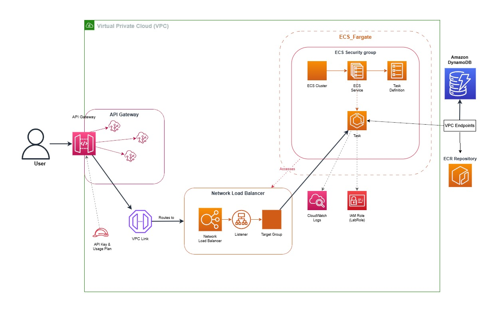

# 🚀 Bitcoin Positions Tracker

> **Production-ready cryptocurrency portfolio manager showcasing cloud-native architecture patterns**

A full-stack Bitcoin trading tracker featuring **dual AWS architectures** (ECS Fargate + Serverless Lambda), real-time price tracking, and infrastructure-as-code deployment.

[](https://aws.amazon.com/)
[](https://nodejs.org/)
[](LICENSE)
---

## ✨ Key Features

- 📊 **Real-time P&L Calculation** - Live Bitcoin prices via Binance WebSocket
- 🏗️ **Dual Architecture** - Compare containerized (ECS) vs serverless (Lambda) approaches
- 🔐 **Enterprise Security** - API Gateway with key authentication + VPC isolation
- 📖 **Auto-generated Docs** - OpenAPI/Swagger specification included
- 💰 **Cost-optimized** - 87% savings with serverless ($7.53/mo vs $57/mo)
- 🎨 **Modern Frontend** - Professional dashboard with live updates

---

## 🏛️ Architecture Overview

<table>
<tr>
<th width="50%">🐳 ECS Fargate (Containerized)</th>
<th width="50%">⚡ Lambda (Serverless)</th>
</tr>
<tr>
<td>

```
API Gateway → VPC Link → NLB
    ↓
ECS Fargate (Express.js)
    ↓
DynamoDB
```

**Pros:** Traditional deployment, full control  
**Cost:** $57/month

</td>
<td>

```
API Gateway → Lambda Functions
    ↓
DynamoDB
```

**Pros:** Auto-scaling, pay-per-use  
**Cost:** $7.53/month ✨

</td>
</tr>
</table>

### Detailed Architecture Diagrams

<div align="center">

#### ECS Fargate Architecture

*Complete VPC setup with private subnets, VPC endpoints, and container orchestration*

#### Lambda Serverless Architecture

*Event-driven serverless design with 5 independent Lambda functions*

</div>

---

## 🛠️ Tech Stack

**Backend:** Node.js 18, Express, AWS SDK v3  
**Infrastructure:** ECS Fargate, Lambda, API Gateway, DynamoDB, VPC Endpoints  
**IaC:** CloudFormation (1300+ lines), automated deployment scripts  
**Frontend:** Vanilla JS, WebSocket, responsive design  
**APIs:** Binance WebSocket, RESTful CRUD

---

## 🚀 Quick Deploy

### Serverless (Recommended)

```bash
# 1. Package Lambda code
cd backend/lambda/lambdas && npm install --omit=dev && cd ..
Compress-Archive -Path lambdas/* -DestinationPath lambda-code.zip

# 2. Upload to S3
aws s3 mb s3://bitcoin-lambda-deploy
aws s3 cp lambda-code.zip s3://bitcoin-lambda-deploy/

# 3. Deploy CloudFormation stack
aws cloudformation deploy \
  --template-file deploy.yml \
  --stack-name bitcoin-tracker-lambda \
  --parameter-overrides LambdaCodeBucket=bitcoin-lambda-deploy \
  --capabilities CAPABILITY_NAMED_IAM

# 4. Get outputs
aws cloudformation describe-stacks \
  --stack-name bitcoin-tracker-lambda \
  --query "Stacks[0].Outputs"
```

**Deploy time:** ~2 minutes | **Cost:** $7.53/month

### ECS Fargate

```bash
cd backend/ecs

# Build & push Docker image
make build && make push

# Deploy infrastructure
aws cloudformation deploy \
  --template-file deploy.yml \
  --stack-name bitcoin-tracker-ecs \
  --parameter-overrides ECRImage=<YOUR_IMAGE_URI> \
  --capabilities CAPABILITY_NAMED_IAM
```

**Deploy time:** ~15 minutes | **Cost:** $57/month

### Frontend (S3 Static Hosting)

```bash
cd frontend
aws s3 mb s3://bitcoin-positions-ui
aws s3 website s3://bitcoin-positions-ui/ --index-document index.html
aws s3api put-bucket-policy --bucket bitcoin-positions-ui --policy file://policy.json
aws s3 sync . s3://bitcoin-positions-ui

# Access at: http://bitcoin-positions-ui.s3-website-us-east-1.amazonaws.com
```

---

## 📡 API Reference

| Method | Endpoint | Auth | Description |
|--------|----------|------|-------------|
| `GET` | `/` | ❌ | API information |
| `GET` | `/health` | ❌ | Health check |
| `GET` | `/openapi.json` | ❌ | Swagger spec |
| `POST` | `/positions` | ✅ | Create position |
| `GET` | `/positions` | ✅ | List positions |
| `GET` | `/positions/{id}` | ✅ | Get by ID |
| `PUT` | `/positions/{id}` | ✅ | Update position |
| `DELETE` | `/positions/{id}` | ✅ | Delete position |

**Authentication:** `x-api-key` header required for protected endpoints

---

## 💡 What This Project Demonstrates

**Cloud Architecture:** Multi-tier design, microservices patterns, VPC networking, cost optimization (87% savings with serverless)

**Infrastructure as Code:** 1300+ lines of CloudFormation templates with automated deployment

**DevOps:** Container orchestration (ECS), serverless architecture (Lambda), CI/CD automation

**Full-Stack:** RESTful APIs (OpenAPI 3.0), NoSQL (DynamoDB), real-time data (WebSocket), modern frontend

---

## 📊 Cost Comparison

| Component | ECS Fargate | Lambda | Savings |
|-----------|-------------|--------|---------|
| Compute | $44.16/mo | $0.53/mo | **99%** ⬇️ |
| API Gateway | $7.50/mo | $7.00/mo | 7% ⬇️ |
| DynamoDB | $5.00/mo | $5.00/mo | - |
| **Total** | **$57/mo** | **$7.53/mo** | **87%** ⬇️ |

*Annual cost:* $684 (ECS) vs **$90.36** (Lambda) = **$593.64 saved/year**

---

## 📸 Screenshots

<div align="center">

### 🎯 Live Trading Dashboard


### 📖 Interactive API Documentation


</div>

---

## 🎓 Academic Context

Built as coursework for Cloud Computing at Universidad de Las Palmas de Gran Canaria. Exceeded all requirements by implementing dual architectures and comprehensive infrastructure automation.

---

## 🚧 Future Enhancements

Potential improvements: AWS Cognito auth, ElastiCache layer, GitHub Actions CI/CD, Terraform templates, multi-region deployment.

---

---

## 📄 License

MIT License - feel free to use this project as a learning resource or portfolio piece.

<div align="center">

**Built by [Sergio Acosta Quintana](https://linkedin.com/in/sergioacostaquintana)**  
*Computer Engineering @ ULPGC*

⭐ Star this repo if you find it useful

</div>